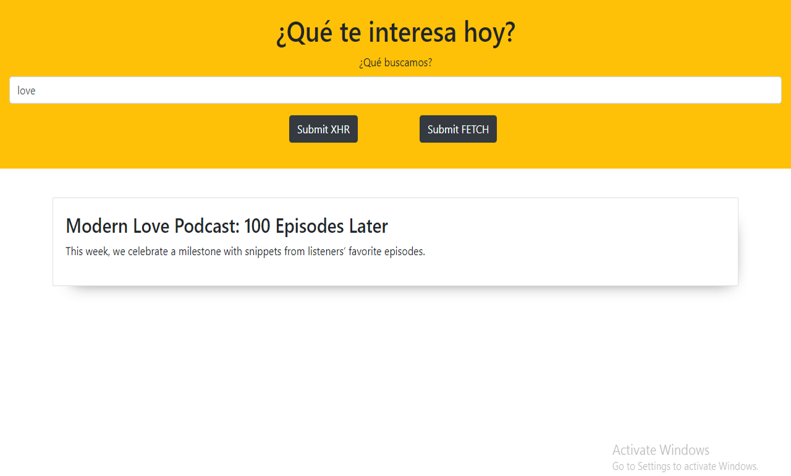

# XHR and FETCH :

* **Curso:** _Construye una single page app (SPA) multiusuario consumiendo data remota_
* **Unidad:** _¿QUÉ SIGNIFICA TRAER DATOS DE UN SERVIDOR ASÍNCRONAMENTE?_

***
## Descripción del proyecto : 
El siguiente proyecto tiene por objetivo realizar peticiones al servidor atravez de `AJAX` utilizando el `API: The NY Times` , para ello se siguieron los siguientes pasos : 
* Primera etapa : 
  * Se decidió que ambas formas de realizar las peticiones compartirían un solo repositorio .
  * Se hizo el registro en la pagina de la API para obtener la clave de acceso.

* Segunda Etapa (etapa técnica) : 
  * Ambas formas de realizar las peticiones de realizaron a travez de un callback del evento click(independiente para cada botón).
  * Para el método XHR se definió una función de alcance global en donde se encapsularon los eventos `onreadystatechange` , `onload` y `onerror`, el primer evento con una funcion anónima como callback y los dos últimos con funciones globales definidas en las siguientes lineas del documento.
  * Para el método fetch se utilizaron promesas.
  * En ambos casos se utilizaron manejadores de errores.
*** 

## Flujo de la aplicación:
* El usuario deberá ingresar una palabra relacionada a la noticia que dese encontrar, hacer click en cualquiera de los botones  y automáticamente saldrá el primer resultado de la búsqueda.

***
 

## Frameworks utilizados:
~~~
Bootstrap 4
~~~
~~~
JQuery
~~~
## Lenguajes Utilizados:
~~~
HTML
~~~

~~~
CSS
~~~
~~~
JavaScript
~~~
 
